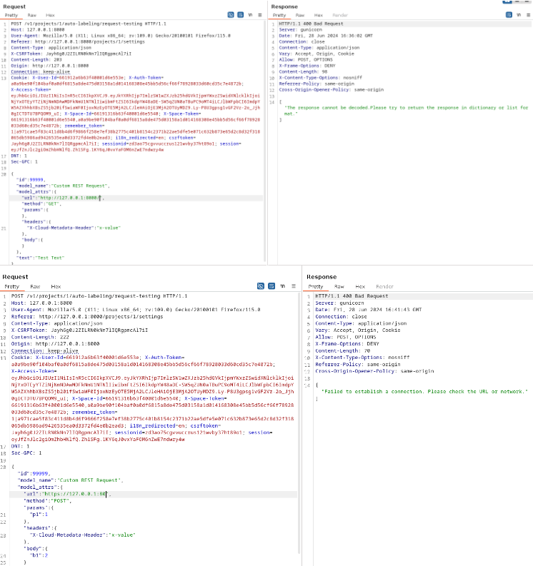

# CVE-2024-40441: Semi-blind SSRF in Doccano's Auto Labeling request-testing

## Description

Doccano's auto labeling functionality allows specifying a Custom REST service to auto annotate data. This can be abused by a malicious project admin to cause an SSRF in order to interact with systems residing in the hosts internal network,
bypassing network restrictions, ACLs and/or firewalls. 

## Privileges Required

Exploitation required project admin privileges.

## Details

Doccano requires the SSRF response to be valid json, otherwise the response body is not displayed and the server responds with an error message, hence the characterization semi-blind. The error message reports whether the request was successful or not.
Ideal exploitation targets are internal json APIs (e.g. Flower API commonly deployed along doccano) and cloud instance metadata services.

## Affected Versions

Doccano v1.8.4 and before

## Proof of Concept: Port Scan

## References

1. https://github.com/doccano/doccano/releases/tag/v1.8.4
2. https://github.com/doccano/doccano/blob/master/backend/auto_labeling/views.py#L114
3. https://github.com/doccano/auto-labeling-pipeline/releases/tag/v0.1.23
4. https://github.com/doccano/auto-labeling-pipeline/blob/master/auto_labeling_pipeline/models.py#L51
5. https://doccano.github.io/doccano/advanced/auto_labelling_config/