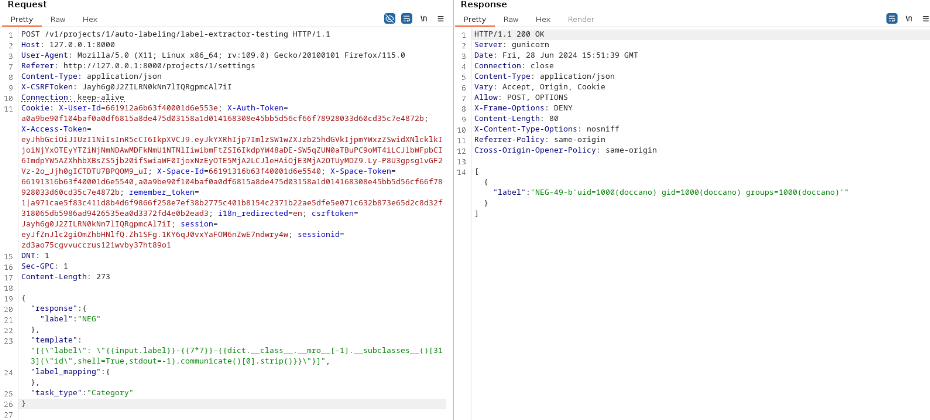

# CVE-2024-40441: Authenticated RCE vi Jinja SSTI in Doccano's Auto Labeling label-extractor-testing

## Description

Doccano's auto labeling functionality allows specifying a Jinja2 template to be rendered by the server's backend. This flaw can be abused to take over the underlying host system by executing shell commands on the server, the result of which is rendered on the response.

## Privileges Required

Exploitation required project admin privileges.

## Affected Versions

Doccano v1.8.4 and before

## Proof of Concept

## References

1. https://github.com/doccano/doccano/releases/tag/v1.8.4
2. https://github.com/doccano/auto-labeling-pipeline/blob/master/auto_labeling_pipeline/mappings.py#L25
3. https://github.com/doccano/auto-labeling-pipeline/releases/tag/v0.1.23
4. https://github.com/doccano/doccano/blob/master/backend/auto_labeling/views.py#L121
5. https://doccano.github.io/doccano/advanced/auto_labelling_config/
6. https://www.onsecurity.io/blog/server-side-template-injection-with-jinja2
7. https://jinja.palletsprojects.com/en/3.1.x/sandbox/